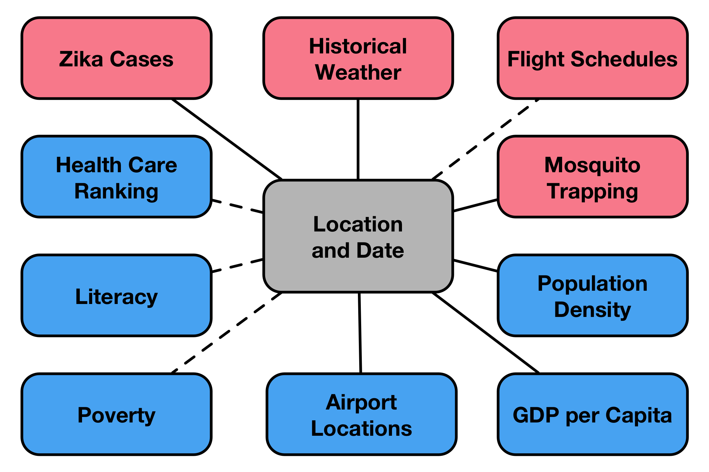

# Predicting Zika Virus Outbreaks
### Michelle L. Gill
#### Project McNulty, Metis NYC DS8
#### 2016/08/05  

---

# Outbreak Overview

* Isolated in monkeys of Zika Forest in Uganda in 1947
* Current outbreak has infected ~1.5 M in Brazil alone
* Causes microcephaly in children born to women infected during pregnancy
* Rare cases of Guillian-Barré syndrome in adults/children
* Currently no vaccine available

^ zoonotic virus identified several decades ago, outbreak in central and south america, causes birth defects

---

# Motivation

1. Ending preventable birth defects and disease-related suffering
2. Minimize financial burden on governments and health care systems

---

# Motivation

1. Ending preventable birth defects and disease-related suffering
2. Minimize financial burden on governments and health care systems

## **Goal: Predict Zika outbreaks before they happen to provide advanced warning for those at risk**

^ Reducing human suffering

---

# Transmission

* Transmitted by bodily fluids and *Aedes aegypti* mosquito
* Vector for yellow fever, dengue fever, and chikungunya
* Two week lifespan, prefers tropical climates

^ Understanding transmission is a key component of predicting Zika outbreaks. Rare cases of transmission by *Aedes albopictus* also exist

---

# Data and Methods [^1]

* Unique location ID constructed from Zika data for merging via SQL
* Merging also facilitated by scraping latitude and longitude 
* Outbreak regions classified by date of first reported case
* Best performing model from AdaBoost ± ADASYN upsampling

[^1]: Project available at [https://github.com/mlgill/zika_prediction](https://github.com/mlgill/zika_prediction)

^ RED boxes: date and location, BLUE boxes: location, best params: temperature, rain, population density, gdp

---

# Results

^ Focused on recall, but upsampled model had better precision, albeit at the expense of recall

---

# Outbreak Timeline and Predictions

* D3 animation created to show outbreak timeline
* Size corresponds to number of cases
* Color indicates prediction (red=Zika positive, blue=Zika negative)
* Fill corresponds to prediction correctness (filled=correct, white=incorrect)

<!-- Uncomment this line to show PNG still in Deckset instead of movie -->

<!-- Uncomment this line to show movie in Deckset instead of PNG still -->
<!--  -->

---

# Conclusions

* Zika outbreaks can be predicted with extremely high degree of recall (98%) using machine learning
* Incorporation of ensembling or additional model features could further improve precision
* Additional testing of model temporal specificity needed

---

# Thank You

## Any questions?

---

# Backup Slides

---

# Future Work

* Incorporate additional data and more sophisticated feature engineering into model
* Compare ensemble models to AdaBoost
* Rigorously test the temporal specificity of scenario modeling
* Changes in class imbalance change over time?

---

# Data Sources (I)

* Zika outbreak data from CDC Epidemic Prediction Initiative's [GitHub zika repo](https://github.com/cdcepi/zika)

* Latitude and longitude keys for Zika outbreaks scraped from Google Maps API, Google Search, and [LatLong](https://www.latlong.net)

* Airport locations scraped from [Falling Rain](http://fallingrain.com)

---

# Data Sources (II)

* Flight schedules scraped from [FlightRadar24](https://www.flightradar24.com)

* Worldwide historical weather data scraped from [Wunderground](https://www.wunderground.com) by proximal airport code

* Population density extracted from gridded map via [NASA Socioeconomic Data and Applications Center (SEDAC)](http://sedac.ciesin.columbia.edu/data/set/gpw-v4-population-density)

---

# Data Sources (III)

* *Aedes aegypti* and *Aedes albopictus* occurrences from [Dryad](http://dx.doi.org/10.5061/dryad.47v3c/1)[^2] [^3]
* GDP and GDP PPP data from IMF World Economic Outlook (2016) and scraped from [knoema.com](https://knoema.com)

[^2]: Kraemer MUG, Sinka ME, Duda KA, Mylne A, Shearer FM, Brady OJ, Messina JP, Barker CM, Moore CG, Carvalho RG, Coelho GE, Van Bortel W, Hendrickx G, Schaffner F, Wint GRW, Elyazar IRF, Teng H, Hay SI (2015) *The global compendium of Aedes aegypti and Ae. albopictus occurrence.* Scientific Data 2(7): 150035. [10.1038/sdata.2015.35](http://dx.doi.org/10.1038/sdata.2015.35)

[^3]: Kraemer MUG, Sinka ME, Duda KA, Mylne A, Shearer FM, Brady OJ, Messina JP, Barker CM, Moore CG, Carvalho RG, Coelho GE, Van Bortel W, Hendrickx G, Schaffner F, Wint GRW, Elyazar IRF, Teng H, Hay SI (2015) Data from: *The global compendium of Aedes aegypti and Ae. albopictus occurrence.* Dryad Digital Repository. [10.5061/dryad.47v3c](http://dx.doi.org/10.5061/dryad.47v3c)

---

# Methodology

* Average weekly weather (temp, rain, wind) was scraped for two weeks before the date of each report
* Incoming flights from infected countries were determined on a rolling basis by date—-like cellular automaton
* Inverse sum used for proximity to positive mosquito identification locations

---

# Selected Research of Interest

* Lauren A Castro, Spencer J Fox, Xi Chen, Kai Liu, Steve E Bellan, Nedialko B Dimitrov, Alison P Galvani, Lauren A Meyers, *Real-time Zika risk assessment in the United States*, **bioRxiv**, (2016) [10.1101/056648](http://dx.doi.org/10.1101/056648)

* T. Alex Perkins, Amir S. Siraj, Corrine W. Ruktanonchai, Moritz U. G. Kraemer & Andrew J. Tatem, *Model-based projections of Zika virus infections in childbearing women in the Americas*, **Nature Microbiology**, (2016) [10.1038/nmicrobiol.2016.126](10.1038/nmicrobiol.2016.126)

